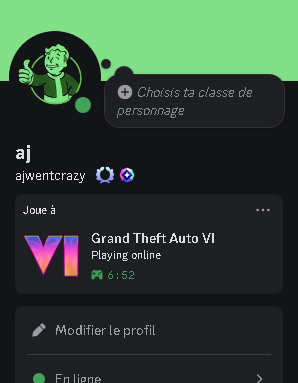

# The V2 of FDS is Avaible Now!
Now there is a config.json, with some settings.

## Initial Setup:

**By default, the script simulates the GTA VI playing status.**

If you want change to something else, go on discord.dev, click on "Application" then "New Application", 
and name it by the things you want simulate, exemple: "Grand Theft Auto VI".

Now copy your Application ID, and past it in the config.json file: `"app_id": "",`

In discord.dev, put the icon of your simulated App in "App icon"

Then in: `"large_image": "",`
put the same file name of your icon.

You can add text in: `"details": "",`

And that's it, you can run it with a .bat file, to keep it open.

## Settings:

You can active the dynamic text option, by replace `"dynamictxt": false,` by `"dynamictxt": true,`

You can change the update speed of the dynamic text by change the value in `"update_interval": 10`

## Preview:

 
